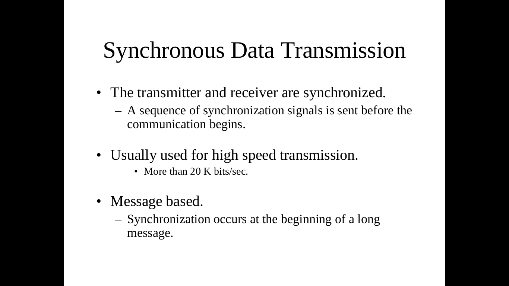
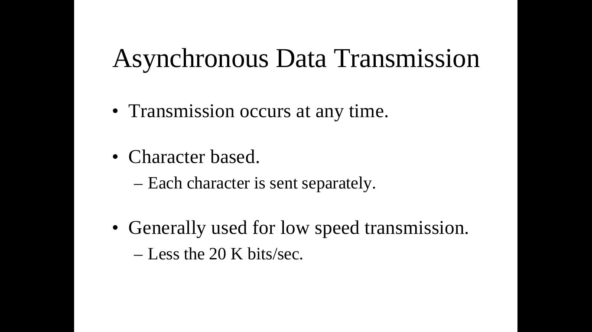
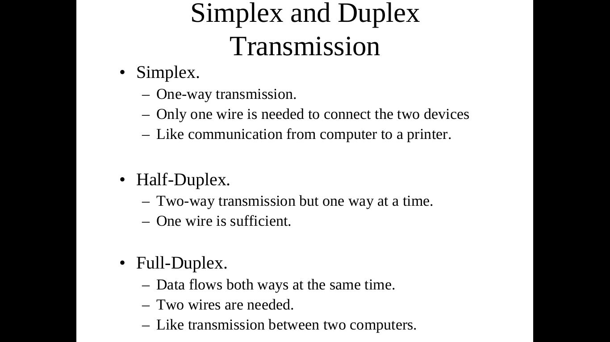
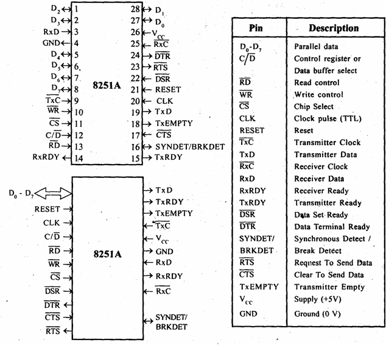

<link rel="stylesheet" href="css/theme/mandeep.css" id="theme">
>###Presentation 
>on
>##*input/output port*

----

>##BY-: 
		>###AMARJEET SINGH
		>###1311017

---

>###Input/Output *port*
 
I/O port are basically interface needed for communication between processor and I/O device.

* These are of two types:-
  *
1. Non programmable

  *
2. programmable

----

>###*Non-programmable* I/O port

These are *fixed* port which work either as input or output port only and there function cannot be changed and its example is Intel 8212

----

>###*Programmable* I/O port

Programmable I/O port is a *multi port* device which can be programmed to work in variety of ways as user likes. e.g. Intel 8255   

---

>###Intel *8255* 

The Intel 8255 Programmable Peripheral Interface (PPI) chip is a peripheral chip originally developed for the Intel 8085 microprocessor.
	It contains Three programmable port Ports-> Port A, Port B, Port C. 
	The port C can be further divided into two ports of 4-bits
	each :- 
	 Port CUPPER, Port CLOWER

----

>###Modes

	The 8255 operates in three modes -:
	Mode 0 -: all operate as simple I/O port
	Mode 1 -: Port A,B operate as strobed I/O Port and Port C 
				act as control word.
	Mode 2 -: Port A operates as strobed bi-directional Port  		 

----

----
	
	Programmer make use of control word that defines which 
	port will act as an input or output.

---

>###Serial Data *Transfer*

Serial data transfer refers to the transfer of only one bit at a time. This is done for cost efficiency. Serial data can be transmitted in two modes:
	

1 Asynchronous Mode

2 Synchronous Mode

----

----

----

----

---

>###*USART*
 
USART stands for Universal Synchronous Receiver- Transmitter. It is an IC used to convert serial data into parallel data so that the computer can process it and vice-versa. It also has an acknowledgement mechanism to make sure that the sender does not transmit at a rate higher than the receiver can handle.

---

>###Intel *8251A* 

The 8251A is a programmable communication interface for serial data transmission. Its a type of USART. It accepts data in parallel format from the CPU and converts them into a continuous serial stream for transmission. Simultaneously, it can receive serial data streams and converts them into parallel data. The data so converted into parallel format are sent to the CPU for processing.

----

----

>###Types Of Control Words-:

1. mode word 

2. command word 

3. status word 

Before starting data transmission, control words are loaded into Intel 8251 

----

>### Steps For Sending Data To CPU

1. TX RDY is connected to interrupt pin 

2. When TX RDY is high it can accept data 

3. When data is received it goes low 

4. Then data is converted in serial form through TXD line 

5. Rate of data is controlled by TXC pin 

----

>### Steps For Receiving Data From I/O device

1. when RX RDY is low it can accept data 

2. when data is received it goes high 

3. Then data is converted in parallel form through RXD line 

4. Rate of data is controlled by RXC pin 

---

# THE END .

